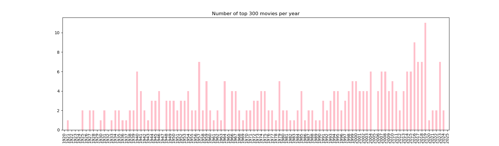
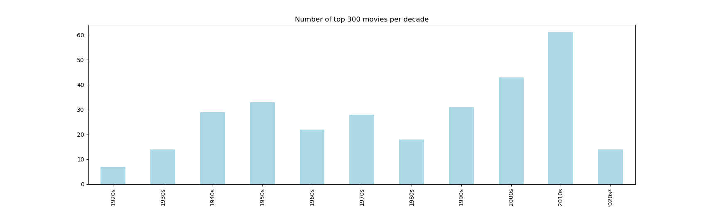

# Some descriptive statistics about the top 300 movies:

- Mean year of top 300 movies: 1983.34
- Median year of top 300 movies: 1988.5
- Oldest movie in top 300: 1921, The Kid (in case of multiple movies from that year, the highest ranked)
- Newest movie in top 300: 2024, The Wild Robot (in case of multiple movies from that year, the highest ranked)
- Year with most movies in top 300: 2019 with 11 movies
- Mean rating of top 300 movies: 96.48
- Median rating of top 300 movies: 97.0
- Highest rated and highest ranked movie in top 300: Seven Samurai with a rating of 4th place
- Lowest rated movie in top 300: Taxi Driver with a rating of 89 in 300th place

*Note: The 2020s decade only includes movies from 2020-2025 as the dataset was created in 2025.